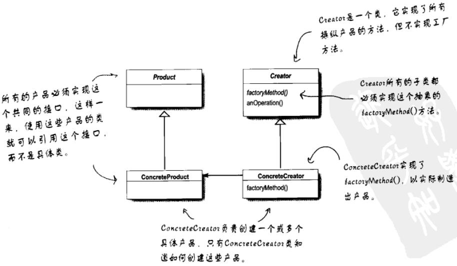

# 工厂方法模式和抽象工厂模式


## 简单工厂

### 需求

现需要为比萨店设计一套比萨订单系统，要注意的是，比萨店有很多种不同类型的比萨，而且这些比萨的种类有可能因为时令、客户需求等因素而增加或删减。


---

### 实现

错误示范：针对具体实现编程

```java
public class PizzaStore {
    Pizza orderPizza(String pizzaType) {
        Pizza pizza = new Pizza();

        // 创建pizza的代码是变化的部分
        if ("cheese".equals(pizzaType)) {
            pizza = new CheesePizza();
        } else if ("greek".equals(pizzaType)) {
            pizza = new GreekPizza();
        }   // etc.

        // 比萨制作的过程是不变的部分
        pizza.prepare();
        pizza.bake();
        pizza.cut();
        pizza.box();
        return pizza;
    }
}
```

缺点：针对实现编程，一旦程序有变化或扩展，就需要重新打开这段代码进行检查和修改。通常这样修改代码将造成系统难以维护，也容易犯错。

> 设计原则：对扩展开放，对修改关闭

> 设计原则：把代码中会变化的部分提取并封装起来，以便以后能更好的改动和扩充这一部分，而不影响不需要变化的其他部分。


**简单工厂** ：将创建批萨的代码移到另一个对象中，由这个对象专职创建批萨，这个对象即为“工厂”，工厂处理创建对象的细节。

注：简单工厂并不是一种设计模式，而更像是一种编程习惯。

```java
public class PizzaStore {
    private SimplePizzaFactory factory;

    public PizzaStore(SimplePizzaFactory factory) {
        this.factory = factory;
    }

    Pizza orderPizza(String pizzaType) {
        // 将变化的部分提取并封装起来
        Pizza pizza = factory.createPizza(pizzaType);

        // 比萨制作的过程是不变的部分
        pizza.prepare();
        pizza.bake();
        pizza.cut();
        pizza.box();
        return pizza;
    }
}
```

使用工厂创建对象的好处：把具体的实例化从客户代码中删除。因为可能有很多的客户代码需要创建一个对象，比如披萨订单类，创建批萨类(PizzaStore类)等等。


---

## 工厂方法模式


### 需求

现比萨店需要扩大经营规模，在多个地区设立加盟店。需要注意的是，各个地域的人对比萨饼的口味要求不一，比如纽约人喜欢薄饼、美味的酱料和少量的芝士；芝加哥人喜欢厚饼、重味的酱料和大量的芝士。因此需要针对不同区域的加盟店生产不同地域风味的比萨饼。


### 实现

错误示范：针对具体实现编程

```java
public class PizzaStoreWithWrongDesign {
    public Pizza createPizza(String region, String pizzaType) {
        Pizza pizza;

        if ("NY".equals(region)) {
            if ("cheese".equals(pizzaType)) {
                return new NYStyleCheesePizza();
            } else if ("veggie".equals(pizzaType)) {
                return new NYStyleVeggiePizza();
            }
        } else if ("Chicago".equals(region)) {
            if ("cheese".equals(pizzaType)) {
                return new ChicagoStyleCheesePizza();
            } else if ("veggie".equals(pizzaType)) {
                return new ChicagoStyleVeggiePizza();
            }
        } else {
            System.out.println("Error: invalid pizza type");
            return null;
        }
    }
}
```

> 设计原则：要依赖抽象，不要依赖具体类（依赖倒置原则）

该原则很像“针对接口编程，不针对实现编程“，但它更强调的是：不能让高层组件依赖底层组件，而且，不管高层或底层组件，”两者“都应该依赖于抽象。例如该场景中，高层组件是PizzaStore类，比萨的实现是底层组件，并且上述代码中，高层组件PizzaStore依赖了这些具体的比萨类。


**简单工厂**：为每一个地区创建一个简单工厂，专门创建这个地区的比萨

```java
// 创建纽约的比萨工厂，再创建纽约的比萨店，两者结合创建出纽约风味的比萨
NYPizzaFactory nyPizzaFactory = new NYPizzaFactory();
PizzaStore nyStore = new PizzaStore(nyPizzaFactory);
nyStore.orderPizza("Veggie");
        
// 创建芝加哥的比萨工厂，再创建芝加哥的比萨店
ChicagoPizzaFactory chicagoPizzaFactory = new ChicagoPizzaFactory();
PizzaStore chicagoStore = new PizzaStore(chicagoPizzaFactory);
chicagoStore.orderPizza("Veggie"); 
```


**工厂方法模式**：定义了一个创建对象的接口，但由子类决定要实例化的类是哪一个。工厂方法让类把实例化推迟到了子类。

工厂方法模式通过让子类决定该创建的对象是什么，来达到将对象创建的过程封装的目的。

```java
public abstract class PizzaStore {

    public Pizza orderPizza(String pizzaType) {
        Pizza pizza;
        pizza = createPizza(pizzaType);

        pizza.prepare();
        pizza.bake();
        pizza.cut();
        pizza.box();
        return pizza;
    }

  	// 让子类决定创建具体的对象
    protected abstract Pizza createPizza(String pizzaType);

}
```



有关抽象工厂的几个问题：

问：工厂方法和创建者是否总是抽象的？
答：不一定，可以定义一个默认的工厂方法来产生某些具体的产品，这样即使创建者没有子类，依然可以创建产品

问：利用字符串传入参数化的类型，如果出现拼写错误就会造成运行时异常（比如cheese写成chese），如何避免？
答：这种错误应该在编译时就避免，比如使用静态常量，使用Java 5支持的枚举类。


> 设计原则：要依赖抽象，不要依赖具体类。（依赖倒置原则，Dependency Inversion Principle）


---

## 抽象工厂模式


### 需求

有些加盟店偷工减料，使用低价原料来增加利润，这种做法会毁坏品牌的形象。于是现在需要创建一家生产原料的工厂，并将原料运送到各家加盟店中。

需要注意，各个地区的口味导致原料不一样，比如纽约和芝加哥分别使用**番茄酱料**和**大蒜蕃茄酱料**，由于地理位置因素导致的原料不一样，比如纽约靠海，所以有新鲜的蛤蛎；芝加哥就必须使用冷冻的蛤蛎。所以对于不同的区域，需要准备不同的原料。


### 实现

抽象工厂模式允许客户使用抽象的接口来创建一组相关的产品，而不需要要知道实际产出的具体产品是什么。这样一来，客户就从具体的产品中解耦。


---

## 总结

所有的工厂模式都用来封装对象的创建：

- 简单工厂，虽然不是真正的设计模式，但是一个简单的方法可以在客户类中从具体类中解耦。
- 工厂方法使用继承，把对象的创建委托给子类，子类实现工厂方法来创建对象。
- 抽象工厂使用对象组合，对象的创建被实现在抽象工厂所暴露出来的方法中。


