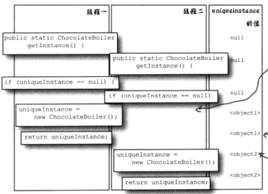

# 单例模式


## 需求

有一些对象只能有一个实例，比如管理共享的资源（数据库连接池、线程池），充当打印机、显卡等设备的驱动程序对象等等。这些对象只能有一个实例，如果创建了多个实例，会导致很多问题，如程序的行为异常，资源使用过量，数据不一致等等。


---

## 实现

方法一：当对象赋给一个全局变量

缺点：使用全局变量，会在程序一开始运行就创建该对象。如果这个对象非常耗费资源，而程序在运行的过程中又没有使用到它，这样就造成了浪费。


使用单例模式：确保一个类只有一个实例，并提供一个全局访问点。


### 单线程版本

```java
public class Singleton {
    private static Singleton uniqueInstance;

    private Singleton() {}

    public static Singleton getSingleton() {
        if (uniqueInstance == null) {
            uniqueInstance = new Singleton();
        }
        return uniqueInstance;
    }
}
```

缺点：在多线程下可能会导致创建多个实例，如下图所示：




---

### 把getInstance()变成同步(synchronized)方法

```java
public class Singleton {
    private static Singleton uniqueInstance;

    private Singleton() {}

    public static synchronized Singleton getInstance() {
        synchronized (Singleton.class) {
            if (uniqueInstance == null) {
                uniqueInstance = new Singleton();
            }
        }
        return uniqueInstance;
    }
}
```

缺点：只有在第一次执行`getInstance()`方法的时候，才需要进行同步。即一旦设置好uniqueInstance，就不再需要同步这个方法，之后每次进行同步都是多余的。


---

### 饿汉模式

在类加载的时候，就创建对象实例（就吃饱），因此称为饿汉模式

```java
public class Singleton {
    private static Singleton singleton = new Singleton();

    private Singleton() {}

    public static Singleton getSingleton() {
        return singleton;
    }
}
```

缺点：不能保证延迟加载，我们往往都希望对象是在需要的时候再创建


---

### 双重锁检查(double checked locking)

> 【推荐】在并发场景下，通过双重检查锁 (double - checked locking) 实现延迟初始化的优化问题隐患 ( 可参考 The " Double - Checked Locking is Broken " Declaration) ，推荐解决方案中较为简单一种 ( 适用于 JDK 5 及以上版本 ) ，将目标属性声明为 volatile 型 。 - 《阿里巴巴Java开发手册》


```java
public class Singleton {
    private static volatile Singleton singleton = null;

    private Singleton() {}

    public static Singleton getInstance() {
        if (singleton == null) {	// 第一层检查，如果已经创建了对象就直接返回，无需上锁
            synchronized (Singleton.class) {
                if (singleton == null) {
                    singleton = new Singleton();
                }
            }
        }
       return singleton;
    }
}
```

需要`volatile`的原因：

`instance = new Singleton()`这句，这并非是一个原子操作，事实上在 JVM 中这句话大概做了下面 3 件事情。

1. 给 instance 分配内存
2. 调用 Singleton 的构造函数来初始化成员变量
3. 将instance对象指向分配的内存空间（执行完这步 instance 就为非 null 了）

volatile可以**禁止指令重排序优化**

